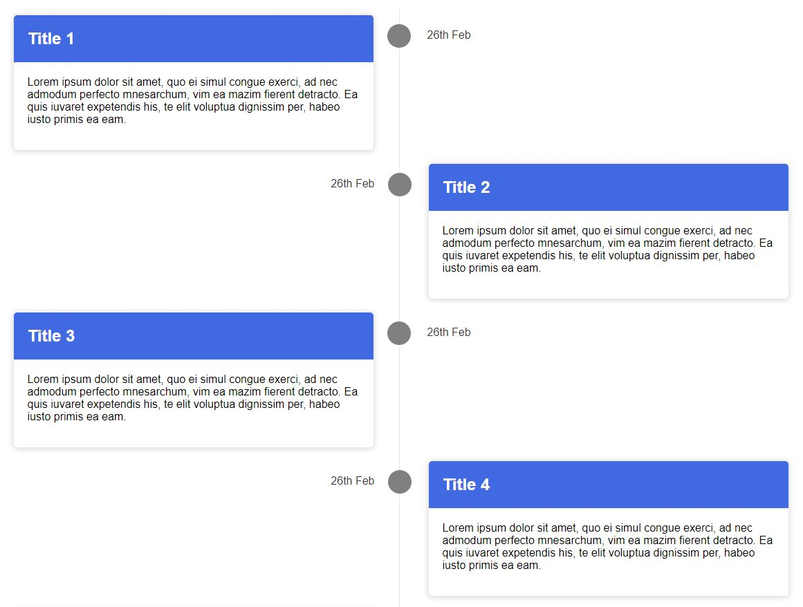
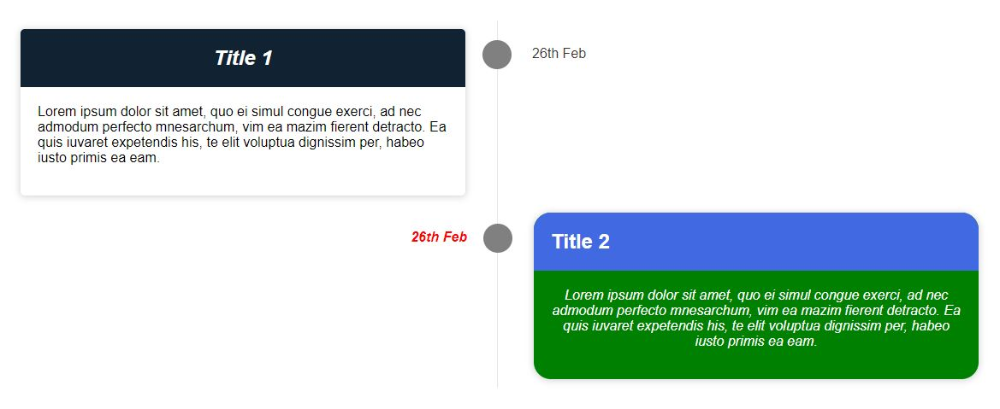

# react-quick-timeline

A simple, customizable &amp; quick timeline UI component for reactjs applications.

## Installation

<br />

```sh
npm i react-quick-timeline
```

<br />

## Basic Usage

<br />

```javascript
import { QuickTimeline } from "react-quick-timeline";
import data from "./data.json";

function App() {
  return (
    <div className="App">
      <QuickTimeline timelineBlocks={data} />
    </div>
  );
}
```

### The most basic form of usage:

**\<QuickTimeline>** : The main component that will be used to create timeline in the UI.

**timelineBlocks** : The required _prop_ that creates the timeline blocks containing the content. This prop takes in an array as the data. If not provided timeline will not be rendered.

Below is the base format of the array:

```json
[
  {
    "title": "Title 1",
    "content": "Lorem ipsum dolor sit amet, quo ei simul congue exerci, ad nec admodum perfecto mnesarchum, vim ea mazim fierent detracto. Ea quis iuvaret expetendis his, te elit voluptua dignissim per, habeo iusto primis ea eam.",
    "date": "26th Feb"
  },
  {
    "title": "Title 2",
    "content": "Lorem ipsum dolor sit amet, quo ei simul congue exerci, ad nec admodum perfecto mnesarchum, vim ea mazim fierent detracto. Ea quis iuvaret expetendis his, te elit voluptua dignissim per, habeo iusto primis ea eam.",
    "date": "26th Feb"
  },
  {
    "title": "Title 3",
    "content": "Lorem ipsum dolor sit amet, quo ei simul congue exerci, ad nec admodum perfecto mnesarchum, vim ea mazim fierent detracto. Ea quis iuvaret expetendis his, te elit voluptua dignissim per, habeo iusto primis ea eam.",
    "date": "26th Feb"
  },
  {
    "title": "Title 4",
    "content": "Lorem ipsum dolor sit amet, quo ei simul congue exerci, ad nec admodum perfecto mnesarchum, vim ea mazim fierent detracto. Ea quis iuvaret expetendis his, te elit voluptua dignissim per, habeo iusto primis ea eam.",
    "date": "26th Feb"
  }
]
```

<br />

| Attribute | Description                                     |
| --------- | ----------------------------------------------- |
| title     | defines title of the timeline block             |
| content   | defines the actual content/details of the block |
| date      | defines the date of the block                   |

<br />
<br />

> _Each object in the array defines individual timeline block. The number of elements totally depends as per your requirement, there is no limit to number of object for timeline blocks_

> _with just the above basic config the below timeline is rendered in the UI_

<br />



<br />

## Advance Usage:

### Generic Customizations:

The timeline component is very much customizable to your specific need and you can perform the below customizations:

1. [Header caption](#header-caption)
   - [Add a header caption](#add-a-header-caption)
   - [Change header text color](#change-header-text-color)
   - [Change header font to bold or italics](#change-header-font-to-bold-or-italics)
2. [Title of timeline blocks](#Title-of-timeline-blocks)
   - [Change title background and text color](#change-title-background-and-text-color)
   - [Change title text alignment](#change-title-text-alignment)
   - [Change title font to bold and italics](#change-title-font-to-bold-and-italics)
3. [Content section of timeline blocks](#content-section-of-timeline-blocks)
   - [Change content background and text color](#change-content-background-and-text-color)
   - [Change content text alignment](#change-content-text-alignment)
   - [Change content font to bold and italics](#change-content-font-to-bold-and-italics)
   - [Change blocks border round size](#change-blocks-border-round-size)
4. [Date](#date)
   - [Change date text color](#change-date-text-color)
   - [Change date font to bold and italics](#change-date-font-to-bold-and-italics)
5. [Change color of timeline vertical line](#change-color-of-timeline-vertical-line)
6. [Time circles](#time-circles)
   - [Change circles background color](#change-circles-background-color)
   - [Change circles border color](#change-circles-border-color)
   - [Hide circles border](#hide-circles-border)
7. [Footer caption](#footer-caption)
   - [Add a footer caption](#add-a-footer-caption)
   - [Change footer text color](#change-footer-text-color)
   - [Change footer font to bold or italics](#change-footer-font-to-bold-or-italics)

<br />

> ### Header Caption

<br />

#### Add a header caption

```javascript
import { QuickTimeline } from "react-quick-timeline";
import data from "./data.json";

function App() {
  return (
    <div className="App">
      <QuickTimeline timelineBlocks={data} headerCaption="My Timeline Header" />
    </div>
  );
}
```

<br />

#### Change header text color

```javascript
import { QuickTimeline } from "react-quick-timeline";
import data from "./data.json";

function App() {
  return (
    <div className="App">
      <QuickTimeline
        timelineBlocks={data}
        headerCaption="My Timeline Header"
        headerCaptionColor="blue"
      />
    </div>
  );
}
```

<br />

#### Change header font to bold or italics

```javascript
import { QuickTimeline } from "react-quick-timeline";
import data from "./data.json";

function App() {
  return (
    <div className="App">
      <QuickTimeline
        timelineBlocks={data}
        headerCaption="My Timeline Header"
        headerCaptionColor="blue"
        headerIsBold={true}
        headerIsItalic={true}
      />
    </div>
  );
}
```

<br />

> ### Title of timeline blocks

<br />

#### Change title background and text color

```javascript
import { QuickTimeline } from "react-quick-timeline";
import data from "./data.json";

function App() {
  return (
    <div className="App">
      <QuickTimeline
        timelineBlocks={data}
        titleBgColor="green"
        titleTextColor="white"
      />
    </div>
  );
}
```

<br />

#### Change title text alignment

```javascript
import { QuickTimeline } from "react-quick-timeline";
import data from "./data.json";

function App() {
  return (
    <div className="App">
      <QuickTimeline
        timelineBlocks={data}
        titleBgColor="green"
        titleTextColor="white"
        titleTextAlign="center"
      />
    </div>
  );
}
```

<br />

#### Change title font to bold and italics

```javascript
import { QuickTimeline } from "react-quick-timeline";
import data from "./data.json";

function App() {
  return (
    <div className="App">
      <QuickTimeline
        timelineBlocks={data}
        titleBgColor="green"
        titleTextColor="white"
        titleTextAlign="center"
        titleIsBold={true}
        titleIsItalic={true}
      />
    </div>
  );
}
```

<br />

> ### Content section of timeline blocks

<br />

#### Change content background and text color

```javascript
import { QuickTimeline } from "react-quick-timeline";
import data from "./data.json";

function App() {
  return (
    <div className="App">
      <QuickTimeline
        timelineBlocks={data}
        contentBgColor="green"
        contentTextColor="white"
      />
    </div>
  );
}
```

<br />

#### Change content text alignment

```javascript
import { QuickTimeline } from "react-quick-timeline";
import data from "./data.json";

function App() {
  return (
    <div className="App">
      <QuickTimeline
        timelineBlocks={data}
        contentBgColor="green"
        contentTextColor="white"
        contentTextAlign="center"
      />
    </div>
  );
}
```

<br />

#### Change content font to bold and italics

```javascript
import { QuickTimeline } from "react-quick-timeline";
import data from "./data.json";

function App() {
  return (
    <div className="App">
      <QuickTimeline
        timelineBlocks={data}
        contentBgColor="green"
        contentTextColor="white"
        contentTextAlign="center"
        contentIsBold={true}
        contentIsBold={true}
      />
    </div>
  );
}
```

<br />

#### Change blocks border round size

```javascript
import { QuickTimeline } from "react-quick-timeline";
import data from "./data.json";

function App() {
  return (
    <div className="App">
      <QuickTimeline
        timelineBlocks={data}
        borderRoundSize=5
      />
    </div>
  );
}
```

<br />

> ### Date

<br />

#### Change date text color

```javascript
import { QuickTimeline } from "react-quick-timeline";
import data from "./data.json";

function App() {
  return (
    <div className="App">
      <QuickTimeline timelineBlocks={data} dateColor="gray" />
    </div>
  );
}
```

<br />

#### Change date font to bold and italics

```javascript
import { QuickTimeline } from "react-quick-timeline";
import data from "./data.json";

function App() {
  return (
    <div className="App">
      <QuickTimeline
        timelineBlocks={data}
        dateColor="gray"
        dateIsBold={true}
        dateIsItalic={true}
      />
    </div>
  );
}
```

<br />

> ### Change color of timeline vertical line

<br />

```javascript
import { QuickTimeline } from "react-quick-timeline";
import data from "./data.json";

function App() {
  return (
    <div className="App">
      <QuickTimeline timelineBlocks={data} timelineLineColor="red" />
    </div>
  );
}
```

<br />

> ### Time circles

<br />

#### change circles background color

```javascript
import { QuickTimeline } from "react-quick-timeline";
import data from "./data.json";

function App() {
  return (
    <div className="App">
      <QuickTimeline timelineBlocks={data} circleBgColor={red} />
    </div>
  );
}
```

<br />

#### Change circles border color

```javascript
import { QuickTimeline } from "react-quick-timeline";
import data from "./data.json";

function App() {
  return (
    <div className="App">
      <QuickTimeline
        timelineBlocks={data}
        circleBgColor="red"
        circleBorderColor="black"
      />
    </div>
  );
}
```

<br />

#### Hide circles border

```javascript
import { QuickTimeline } from "react-quick-timeline";
import data from "./data.json";

function App() {
  return (
    <div className="App">
      <QuickTimeline
        timelineBlocks={data}
        circleBgColor="red"
        circleBorderHide={true}
      />
    </div>
  );
}
```

<br />

> ### Footer Caption

<br />

#### Add a footer caption

```javascript
import { QuickTimeline } from "react-quick-timeline";
import data from "./data.json";

function App() {
  return (
    <div className="App">
      <QuickTimeline timelineBlocks={data} footerCaption="My Timeline Footer" />
    </div>
  );
}
```

<br />

#### Change footer text color

```javascript
import { QuickTimeline } from "react-quick-timeline";
import data from "./data.json";

function App() {
  return (
    <div className="App">
      <QuickTimeline
        timelineBlocks={data}
        footerCaption="My Timeline Header"
        footerCaptionColor="blue"
      />
    </div>
  );
}
```

<br />

#### Change footer font to bold or italics

```javascript
import { QuickTimeline } from "react-quick-timeline";
import data from "./data.json";

function App() {
  return (
    <div className="App">
      <QuickTimeline
        timelineBlocks={data}
        footerCaption="My Timeline Header"
        footerCaptionColor="blue"
        footerIsBold={true}
        footerIsItalic={true}
      />
    </div>
  );
}
```

<br />

### Individual Block Customization

Apart from the generic customization using props in `<QuickTimeline>` component each timeline block can be styled using the same properties by incorporating it inside individual object in the data array like below:

```json
[
  {
    "title": "Title 1",
    "content": "Lorem ipsum dolor sit amet, quo ei simul congue exerci, ad nec admodum perfecto mnesarchum, vim ea mazim fierent detracto. Ea quis iuvaret expetendis his, te elit voluptua dignissim per, habeo iusto primis ea eam.",
    "date": "26th Feb",
    "titleBgColor": "#112233",
    "titleTextColor": "white",
    "titleTextAlign": "center",
    "titleIsBold": true,
    "titleIsItalic": false
  },
  {
    "title": "Title 2",
    "content": "Lorem ipsum dolor sit amet, quo ei simul congue exerci, ad nec admodum perfecto mnesarchum, vim ea mazim fierent detracto. Ea quis iuvaret expetendis his, te elit voluptua dignissim per, habeo iusto primis ea eam.",
    "date": "26th Feb",
    "contentBgColor": "green",
    "contentTextColor": "white",
    "contentTextAlign": "center",
    "contentIsBold": false,
    "contentIsItalic": true,
    "borderRoundSize": 20,
    "dateColor": "red",
    "dateIsBold": true,
    "dateIsItalic": true
  }
]
```

<br />

| Attribute        | Value                                | Description                                                                             |
| ---------------- | ------------------------------------ | --------------------------------------------------------------------------------------- |
| titleBgColor     | #ffffff / rgb(255,255,255) / "white" | defines title's background color of individual timeline block                           |
| titleTextColor   | #ffffff / rgb(255,255,255) / "white" | defines title's text color of individual timeline block                                 |
| titleTextAlign   | left / center / right                | defines title's text alignment of individual timeline block                             |
| titleIsBold      | true / false                         | defines if title's text should be bold or not of individual timeline block              |
| titleIsItalic    | true / false                         | defines if title's text should be italic or not of individual timeline block            |
| contentBgColor   | #ffffff / rgb(255,255,255) / "white" | defines content's background color of individual timeline block                         |
| contentTextColor | #ffffff / rgb(255,255,255) / "white" | defines content's text color of individual timeline block                               |
| contentTextAlign | left / center / right                | defines content's text alignment of individual timeline block                           |
| contentIsBold    | true / false                         | defines if content's text should be bold or not of individual timeline block            |
| contentIsItalic  | true / false                         | defines if content's text should be italic or not of individual timeline block          |
| borderRoundSize  | integer between 0 to 30              | defines the border round size of individual timeline block. Takes value between 0 to 30 |
| dateColor        | #ffffff / rgb(255,255,255) / "white" | defines the text color of date of individual timeline block                             |
| dateIsBold       | true / false                         | defines if date's text should be bold or not of individual timeline block               |
| dateIsItalic     | true / false                         | defines if date's text should be italic or not of individual timeline block             |

<br />
This will render the output as below



<br />

> Note : the _props_ related to time circles `(circleBgColor, circleBorderColor, circleBorderHide)` are generic and cannot be customized individually i.e, they cannot be used inside the _.json_ file

<br />

Thats All, Happy Timelining 🙂

<br />

# License

MIT &copy; [Sajin Soman](https://github.com/Fox333-Lab)
